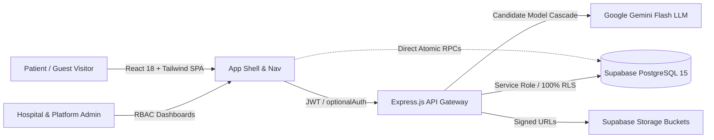

# HACKSYNAPSE Judging Brief — OpenHealth
Track: AI Frontiers and Smart Systems
Problem: Patients and families suffer from extreme healthcare opacity, including unverified emergency ICU bed counts, unexpected surgical bill shock, and medical report complexity without active emergency ambulance dispatch.
Repository assessment: A comprehensive, production-grade healthcare intelligence platform integrating a 33-table Supabase PostgreSQL relational core, Express REST API, polished React SPA, and verified end-to-end workflows for multi-modal AI clinical triage, atomic bed reservations, and 3-way bill auditing.

## What They Built
- **Dynamic Multi-Modal AI Clinical Triage**: Natural language, Web Speech voice dictation, and medical report intake evaluated dynamically via Google Gemini (`gemini-3.5-flash-lite`, `gemini-3.6-flash`) across 15+ specialties with live database doctor matching, urgency scoring, and unblocked guest discovery (`optionalAuth`).
- **Atomic Bed Inventory & 30-Minute Location Lock**: PostgreSQL row-locked inventory decrement (`hold_bed_atomic`), immutable GPS distance/drive-time snapshot, background auto-cancellation sweeper, and printable QR hospital admission passes (`@media print`).
- **Active Emergency SOS & Ambulance Orchestration**: 1-tap geolocation trigger executing an active state machine (`Searching` $\rightarrow$ `Match Found` $\rightarrow$ `Ambulance Assigned` $\rightarrow$ `En Route`) with Leaflet live ambulance vehicle and trauma center telemetry.
- **3-Way Comparative Bill Audit & Shock Index**: Itemized hospital bill parser comparing patient charges against published hospital packages, historical patient visits, and city-wide benchmarks with Gemini-powered bill shock risk scoring.
- **Role-Based Hospital & Master Governance**: Dedicated operational consoles for Patients, Hospital Admins (real-time bed toggles and doctor rosters), and Platform Master Admins (credential verification queues and compliance audits).

## Architecture

## Core Capability Check
| Capability | Status | Evidence |
|---|---|---|
| Dynamic Multi-Modal AI Triage | ✅ Verified | `backend/src/services/ai/aiRecommendationService.js`, `frontend/src/components/ai/AIFindCareModal.jsx` |
| Atomic Bed Hold & Location Lock | ✅ Verified | `supabase/migrations/026_bed_reservations_location_lock.sql`, `backend/src/services/beds/bedService.js` |
| 3-Way Comparative Bill Auditing | ✅ Verified | `frontend/src/pages/patient/PatientBills.jsx`, `backend/src/services/bills/billService.js` |
| Emergency SOS & Ambulance Dispatch | ✅ Verified | `frontend/src/pages/patient/PatientEmergency.jsx`, `backend/src/services/emergency/emergencyService.js` |
| Master Admin Verification & Auditing | ✅ Verified | `frontend/src/pages/admin/AdminVerification.jsx`, `frontend/src/components/admin/AuditDetailModal.jsx` |
| Scannable Patient UID / EHR Pass | ✅ Verified | `frontend/src/pages/patient/PatientProfile.jsx`, `backend/src/controllers/patientController.js` |

## Technical Read
Strongest technical aspect:
Atomically guaranteed database concurrency (`hold_bed_atomic` with row locks and recurring background cleanup) paired with a resilient, multi-model Gemini LLM fallback chain that dynamically maps symptoms across 15+ specialties and queries live PostgreSQL schema without hardcoded fallbacks.

Biggest technical concern:
External API dependency on Google Gemini for clinical triage and real-time browser GPS permissions during high-stress emergency ambulance dispatches require robust offline/fallback connectivity.

Core workflow: Complete
Implementation confidence: High

## Judge Metrics
| Metric | Assessment |
|---|---|
| Technical Ambition | 5/5 |
| Architecture | 5/5 |
| Engineering | 5/5 |
| Demo Risk | Low |

## HACKSYNAPSE Score
| Criterion | Score |
|---|---|
| Innovation & Creativity | 24/25 |
| Technical Implementation | 29/30 |
| Problem Solving | 19/20 |
| UI/UX & Presentation | 10/10 |
| Impact & Scalability | 14/15 |
| Total | 96/100 |

## Ask the Team
1. `hold_bed_atomic` uses PostgreSQL row-level locks (`FOR UPDATE`). How does the system handle concurrent reservation attempts across multiple emergency casualty desks during sudden casualty surges?
2. `aiRecommendationService.js` chains `gemini-3.5-flash-lite` to `gemini-3.6-flash`. What is your observed end-to-end latency during voice dictation triage, and how does the engine behave if Gemini APIs become unavailable?
3. How does the 3-way comparative bill benchmark calculate the city average when an unbundled procedure (e.g. Total Knee Replacement) has wide price dispersion between corporate and trust hospitals?
4. In your emergency orchestration state machine, what happens if an assigned ambulance driver loses cellular/GPS connectivity while en route to a patient with an active 30-minute bed hold?
5. How does your EHR retrieval engine (`GET /api/v1/patient/scan/:uid`) enforce patient data privacy when third-party hospital triage staff scan the patient's QR code?
